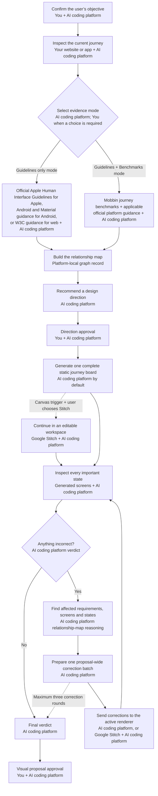

# Using Design Arc

[Home](../README.md) · [Getting started](getting-started.md) · [Using Design Arc](using-design-arc.md) · [Codex](codex.md) · [Claude Code](claude-code.md) · [Google Antigravity](antigravity.md) · [FAQ](faq.md) · [Runtime boundaries](runtime-boundaries.md) · [Advanced controls](advanced-controls.md) · [Evidence and methodology](evidence-and-methodology.md) · [Upgrades and migration](upgrades-and-migration.md) · [Migration history](migration-history.md) · [Trust and sources](trust-limitations-and-sources.md)

How do I use Design Arc after installation?

## Start a review in ordinary language

Describe the product outcome you want in ordinary language. For example: “Use Design Arc to help me make our onboarding less confusing.” Explicitly asking Codex, Claude Code, or Google Antigravity to use Design Arc invokes it directly.

Commands are optional shortcuts, not required knowledge.

If your AI coding platform selects Design Arc for a suitable request that did not invoke it directly, it asks for permission before beginning. Until you approve, it does not start setup, inspect your product, gather Design Arc evidence, or create Design Arc project or review records. Automatic skill selection is not guaranteed, so ask for Design Arc by name when certainty matters. Runtime-specific return paths are described in the [Codex runtime](codex.md), [Claude Code runtime](claude-code.md), and [Google Antigravity runtime](antigravity.md) pages. Design Arc does not run continuously or silently in every task.

Codex, Claude Code, or Google Antigravity may offer Design Arc for requests such as:

- “Help me make our onboarding less confusing.”
- “Audit how customers complete checkout and propose a better complete journey.”
- “Redesign account recovery so people can get back in without weakening security.”

Natural-language requests such as “use Guidelines only for this run” or “follow your recommendation this time” are one-run overrides; they do not rewrite the saved project preference.

The workflow, evidence rules, approval modes, renderer choice, and design-only handoff boundary are shared. Invocation, saved preferences, active-review records, return paths, and adapter upgrades are platform-specific. Codex, Claude Code, and Google Antigravity never merge, migrate, resume, or continue an active review across runtimes. Runtime-specific installation, invocation, saved state, returning later, visual capabilities, and upgrades belong to the [Codex runtime](codex.md), [Claude Code runtime](claude-code.md), and [Google Antigravity runtime](antigravity.md) pages. [Runtime boundaries](runtime-boundaries.md) explains why these details stay separate.

## Return to a project

The return path is a runtime detail. Use [Design Arc for Codex](codex.md) for Codex project homes, [Design Arc for Claude Code](claude-code.md) for Claude Code re-entry and its optional reminder, and [Design Arc for Google Antigravity](antigravity.md) for Antigravity re-entry. A runtime-specific return path never merges or continues a review from another runtime.

## Choosing your AI coding platform or Stitch for the screens

After you approve the direction, Design Arc asks how to visualize it before generating anything. It does not build disposable application logic merely to visualize the proposal.

The upfront choices are **Both the AI coding platform and Stitch — recommended**, **AI coding platform only**, or **Stitch only**. Both gives you two independent interpretations from the same approved specification. The platform-only route is fastest for a static journey board; Stitch supplies a persistent editable canvas. Stitch remains optional and separately authorized.

Design Arc never waits for the platform board to be inadequate before mentioning Stitch. It records your initial renderer choice once and does not ask again unless you change it or a selected renderer becomes unavailable.

When you choose both, Design Arc starts the AI coding platform board and Stitch workspace concurrently from the same approved specification. It waits for both initial renders before correcting either one. Each render is then checked independently against the approved specification before the pair is compared. After that comparison, you choose whether corrections continue on the platform version, the Stitch version, or both. Choosing both initially does not commit you to correcting both. When only one is selected, Design Arc changes only that version and preserves the other as comparison evidence. When both are selected for a correction round, those corrections run concurrently. Both share one limit of three proposal-wide correction rounds; they do not receive three rounds each. If either initial render fails, Design Arc reports that the comparison is incomplete and asks before continuing with only one renderer.

When you choose Stitch, Design Arc preserves the approved requirements and compares the latest retrieved or supplied Stitch changes before accepting them as the current proposal. In Codex, the plugin includes the connection definition and prompts securely for the user's own key when needed. Stitch remains separately authorized.

## What happens after screens render

Design Arc corrects straightforward visual drift before asking you to approve the visual proposal. The initial proposal may be followed by at most three correction rounds for the whole proposal. Each round batches every known repairable mismatch, generates a new proposal, and reinspects the complete result. The same validation and correction rules apply whether your AI coding platform or Stitch renders the screens.

If the proposal still does not match, Design Arc stops and flags every unresolved mismatch and the attempts already made. It asks sooner only when the correction would change the approved direction, requires new authorization, or cannot be proven in a prototype.

## Approval and trust controls

> Design Arc does not silently redesign, implement, or deploy your product. You choose the objective, evidence approach, and approval behavior.

Objective Confirmation establishes the product outcome before the audit or evidence gathering begins. The Direction Gate confirms the recommended design direction; the Visual Proposal Gate confirms the validated visual proposal. Existing 0.3.x review records may call this the Stitch Gate; it is the same gate, not an additional approval.

| Approval mode | Objective | Visual Proposal Gate |
| --- | --- | --- |
| **Guided** — recommended for a new project | Confirm; stop at Direction Gate | Stop for approval |
| **Follow recommendation** | Confirm; continue at Direction Gate with the visibly marked recommendation | Stop for approval |
| **Fully automatic** | The current request must state an explicit objective; continue at Direction Gate with the visibly marked recommendation | Continue only after a `meets direction` verdict |

“Follow your recommendation” is a one-run Follow recommendation alias. “Bypass both gates” is a one-run Fully automatic alias, but it never permits Design Arc to invent a missing objective. Automatic modes change decision pauses, not the audit, evidence, complete-state, validation, or ownership requirements.

## Graph-assisted corrections

Design Arc understands how requirements, evidence and screens affect one another, helping it make more precise corrections without surrendering approval control.

Graph assistance is active by default for every new 0.3.0 review in both existing and new projects when no project or platform-local safety control turns it off. That default does not rewrite project preferences or platform-local settings. An active review remains exactly as it started; its next clean review gains the 0.3.0 assistance.

Graph assistance adds no approval gate. Objective Confirmation, the Direction Gate, the Visual Proposal Gate, the active approval mode, and the full review of every important state remain exactly the same.

The loop controls what happens and when Design Arc stops. The relationship map helps Design Arc understand what each correction affects; it advises the loop but never replaces it.

Official Apple guidance governs Apple platform requirements; the applicable first-party guidance does the same for Android or web. Mobbin supplies product precedent only in Guidelines + Benchmarks mode.

Before Stitch is used, your AI coding platform prepares the complete evidence-grounded journey, requirements, and important-state inventory. Stitch visualizes rather than establishes correctness; your AI coding platform validates the returned screens and applies the same proposal-wide correction loop of up to three rounds. Stitch remains optional and separately authorized. For platform-specific visual capabilities and recommendation details, use the [Codex runtime](codex.md), [Claude Code runtime](claude-code.md), or [Google Antigravity runtime](antigravity.md) page.

The Live Codex plugin includes the Google-hosted Stitch MCP connection definition, so Codex users do not need to discover or install a separate Stitch MCP. It does not bundle Google server code, a Stitch account, or credentials. Stitch remains separately authorized through the user's own API key. The Claude Code and Antigravity Alpha adapters do not yet include automated Stitch onboarding. Google now provides an official Stitch MCP server and SDK. When a particular review actually uses an MCP, its run record and evidence labels name the exact configured MCP server or tool; otherwise they name the browser or manual access path used. Design Arc does not imply an official Mobbin MCP integration.

Graph assistance is optional internal reasoning support. If it is unavailable or turned off, Design Arc continues the same review without it. It never replaces evidence, platform guidance, approvals, or complete screen inspection. People who want to inspect or manage it can use the commands in [Advanced controls](advanced-controls.md).

Next: [Evidence and methodology](evidence-and-methodology.md).
